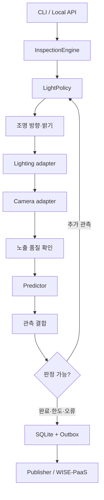

# 구조와 수정 위치

코어는 장비의 구체적인 API를 모르고, `ports.py` 계약으로 호출합니다.
실제 구현 선택은 `service.py` 한 곳에서 합니다.

## 디렉토리

| 경로 | 수정할 내용 |
|---|---|
| `src/revision/domain.py` | 조명, 프레임, 결함, 관측, 최종 결과 공통 형식 |
| `src/revision/ports.py` | 부품 간 인터페이스 |
| `src/revision/inspection.py` | 검사 순서, 종료 조건, 예외 처리 |
| `src/revision/policies.py` | 어떤 조명으로 다시 볼지 결정 |
| `src/revision/fusion.py` | 여러 관측을 결합하는 방식 |
| `src/revision/adapters/` | 카메라/LED/ONNX/DB/클라우드 구체 구현 |
| `src/revision/ml/` | 전처리, 학습 및 ONNX export 기준선 |
| `src/revision/data/` | 데이터 검증, 그룹 분할, 평가 지표 |
| `src/revision/api.py` | 로컬 검사·기록 API |
| `src/revision/service.py` | 장치와 알고리즘 조립·수명 관리 |
| `configs/` | 하드웨어, 판정 한도, 조명 후보 설정 |
| `notebooks/01_train_colab.ipynb` | Colab GPU·Drive 학습 실행 |
| `src/revision/ml/train_torch.py`, `export_torch.py`, `artifacts.py` | GPU 학습·재개, ONNX 검증, 영속 저장 |
| `src/revision/data/staging.py` | Drive 폴더/ZIP → 작업 디스크 복사·분할 |
| `data/`, `models/` | 데이터 형식 예제와 모델 manifest |
| `hardware/` | MCU 통신 규격과 장비 연결 지침 |
| `apps/dashboard/`, `integrations/` | WISE 대시보드와 생산라인 확장 계약 |
| `tests/`, `.github/workflows/` | 핵심 동작 테스트와 CI |

## 동작 규칙

1. 한 station 프로세스에서 한 번에 하나의 검사만 실행합니다. API도 worker=1입니다.
   여러 프로세스에서 동일 serial/camera를 공유하는 잠금은 제공하지 않습니다.
2. 조명 command ACK 후 settling 시간을 기다리고 프레임을 취득합니다.
3. 과노출/암부가 기준을 넘으면 해당 프레임은 저장하되 AI 판정 증거로 사용하지 않습니다.
4. 유효한 관측의 최대 결함 점수를 사용합니다. 다른 조명에서 결함이 안 보인다는 이유로
   기존 결함 점수를 평균으로 지우지 않습니다. 높은 오탐 역시 유지될 수 있어 후속 공간 결합이 필요합니다.
5. 높은 결함 점수는 FAIL, 낮은 점수와 최소 관측 수 충족은 PASS입니다.
   그 외는 재촬영하며 후보/횟수/시간이 소진되면 REVIEW입니다.
6. 정상 종료·예외 모두 조명을 끕니다. 조명 종료 실패는 ERROR로 올립니다.
   저장 실패는 호출자에게 예외를 반환합니다.
7. 최종 결과와 outbox는 한 DB 트랜잭션으로 저장합니다.
   클라우드가 끊겨도 검사 기록은 남으며 전송은 별도 `flush`로 재시도합니다.

`budget_ms`는 관측 단계 사이와 추론 후 확인하는 **soft deadline**입니다.
USB 드라이버나 추론 호출을 강제로 중단하는 hard real-time 보장은 아닙니다.
운영 환경은 SDK timeout, 별도 장치 프로세스 watchdog, MCU 자체 LED timeout을 추가해야 합니다.

## 모델과 조명 정책 교체 예

- YOLO/segmentation 모델: 새 `Predictor.predict(frame)`에서 원본 좌표의 `Defect`를 반환합니다.
  `defect_score` 집계 의미를 정의하고 threshold를 다시 검증합니다.
- 공간 fusion: 조명 사이 부품 움직임을 보정한 뒤 bbox/마스크 대응 및 결함별 증거를 누적합니다.
- 학습 정책: `LightPolicy.select(actions, observations)`만 구현하여 후보 중 하나를 반환합니다.
  실제 장비 제어는 policy 내부에서 하지 않습니다.
- Hailo/TensorRT/OpenVINO: 각 런타임용 predictor를 추가합니다. `.onnx` 파일이 있다는 이유로
  특정 NPU 지원이 자동 확보되지는 않습니다.
- 산업용 카메라: hardware trigger 및 실제 exposure timestamp가 있는 Camera adapter로 교체합니다.
  현재 OpenCV buffer flush는 촬영 신선도를 보장하는 산업용 동기화의 대체물이 아닙니다.
